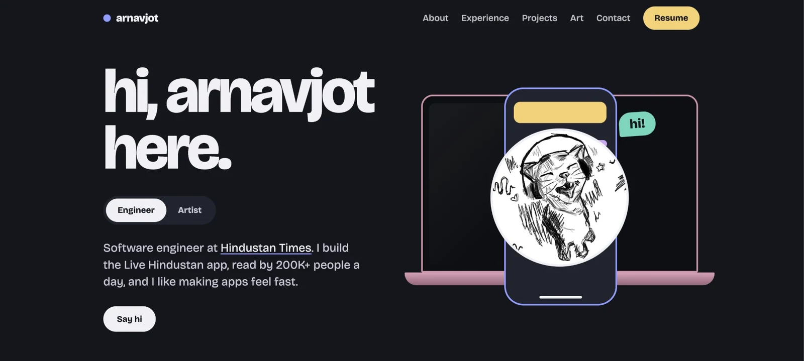
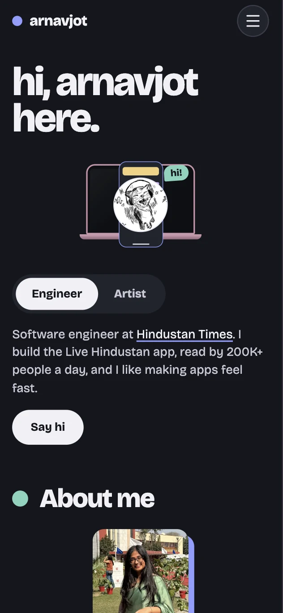
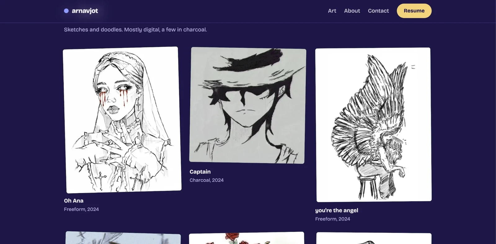

# arnavjot

Personal portfolio of **Arnavjot Kaur**, software engineer and artist.

A fast, static site built with plain HTML, CSS and vanilla JavaScript. There is no framework, no build step and no dependencies: open it, edit it, push it.

## Screenshots

**Desktop, Engineer mode**



**Phone**



**Artist mode, art gallery**



## Features

- **Engineer / Artist modes.** One toggle switches the whole page: the hero text, the shapes, the colours and the section order. The phone-and-laptop graphic morphs into a set of art shapes (the laptop shrinks into a star) and back again.
- **Interactive hero.** Hover (desktop) or tap (phone) the phone to zoom the doodle, with a "hi!" bubble. The doodle also gives a short hint on load, once it has finished loading.
- **Experience.** Clickable highlight tabs. The content supports several jobs: with two or more, company tabs appear; with one job there are none.
- **Projects, education and recognition**, with links.
- **Art gallery.** Tilted cards, a preview with next / previous, and a full collection view in Artist mode. Images are small WebP files that load on demand.
- **Profile photo preview**, resume viewer (with a loading animation) and a mobile menu.
- **Rich text links.** Write `[text](https://example.com)` in the hero and About text.
- **Open in Artist mode** with `#artist` on the URL.
- **Light on bandwidth.** The script is about 45KB, images are WebP, and art is loaded in the background after the page appears.

## Files

| Path | What it is |
| --- | --- |
| `index.html` | Page shell |
| `style.css` | All styles |
| `script.js` | Your content (at the top), plus the code that builds and runs the page |
| `img/` | Doodle, profile photo and the icons (`favicon.svg`, `favicon.png`, `apple-touch-icon.png`) |
| `art/` | Art images: `name.webp` for the full view and `name-sm.webp` for the grid |
| `screenshots/` | The pictures in this README |

## Editing the content

All text, links and image paths live in the `DATA` object at the top of `script.js`, between the `CONTENT` markers. Edit it, commit and push.

- **Anything left out falls back to a default in the code:** button and heading labels (override them with a `ui` object), `layout`, `startMode`, `title` and so on.
- **Jobs:** `work` can be a single job, or a list of jobs (newest first). Each job takes `role`, `company`, `period`, and either `highlights` (clickable tabs) or `points` (a plain list).
- **Education:** add more entries to the `education` list.
- **Art:** each item takes `image`, an optional `thumb`, `title`, `medium` and `year`. A file `art/name.webp` automatically uses `art/name-sm.webp` for its grid thumbnail.
- **Images:** the doodle and photo are files in `img/`, set by `site.doodleUrl` and `site.photoUrl`. Replace the file or change the path.
- **Preview other content** without editing the file by adding `?data=<json-url>` to the page URL.

## Modes and links

- `…/#artist` opens straight into Artist mode. Without it the page uses `site.startMode` (Engineer by default).
- Section links still work, for example `…/#work`.

## Run locally

Serve the folder with any static server, for example:

```
python3 -m http.server 8000
```

Then open http://localhost:8000.

## Deploy

Push to GitHub, then turn on GitHub Pages in the repository settings (deploy from the `main` branch, root folder).
